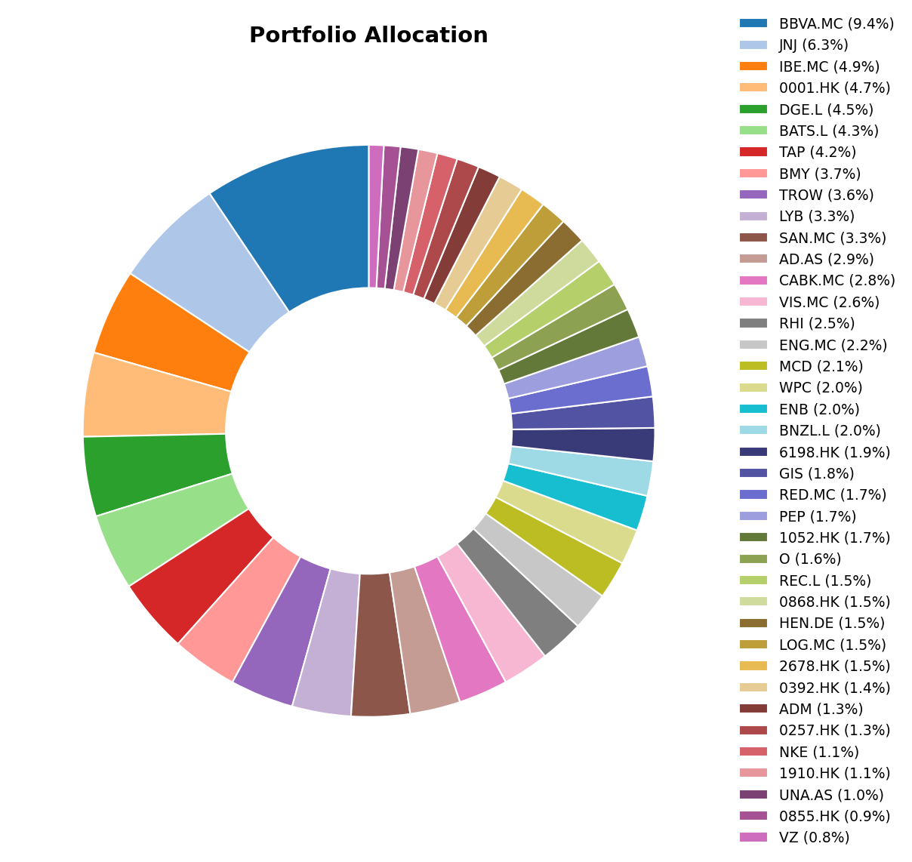
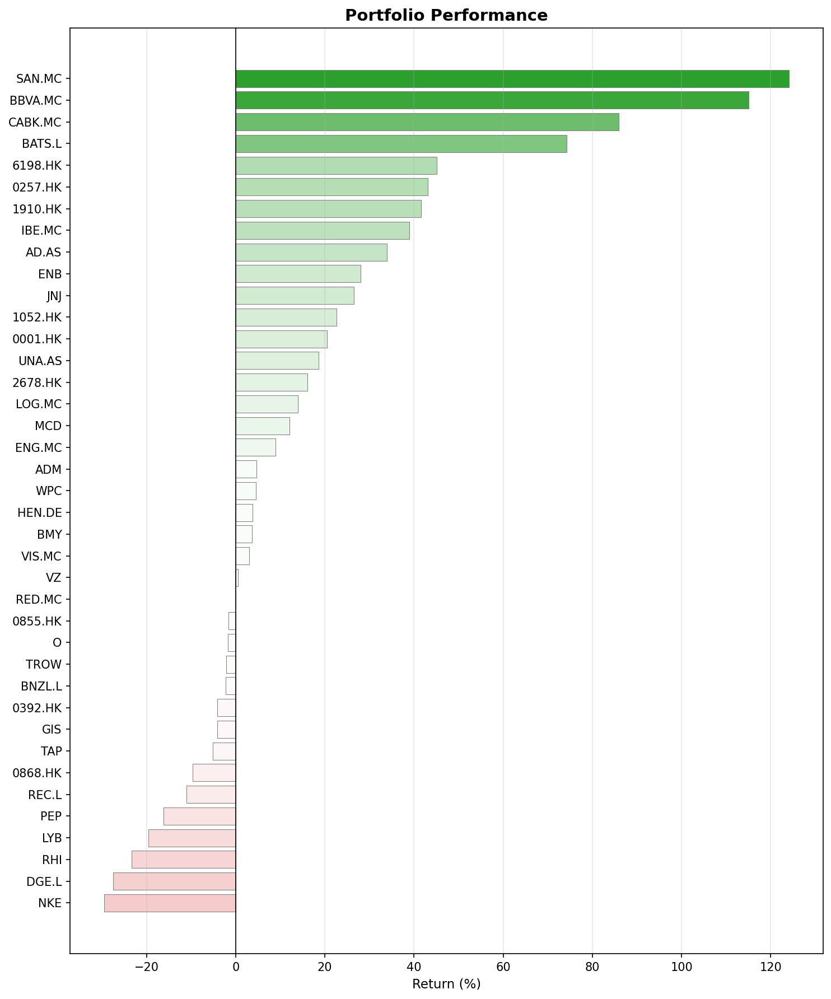
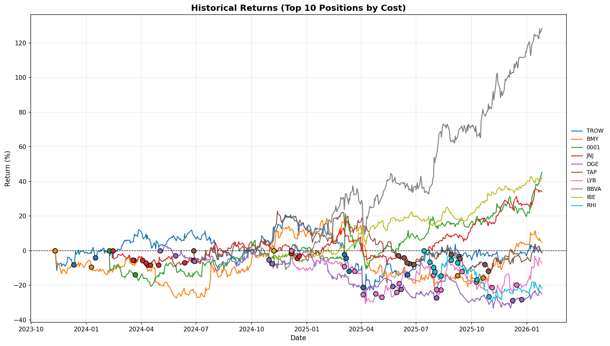

## Major Investing & Economic Events

- **Fed Rate Cut:** Fed interest rate cut. Difficult to tell what comes next. Whatever it is, we should try to be prepared and invest with a decent margin of safety.
- **Trade Ceasefire with China:** The trade war between US and China seems to have slowed down, including mutual tariff reductions and agreements on rare earth and ship imports.

## Historical Investing Events in December

- **December 1980:** Paul Volcker's Fed raised rates to 21.5%, the highest in US history. Crazy interest rates!
- **December 1996:** Alan Greenspan's famous "irrational exuberance" speech. I didn't know about this one. I'll definitely look it up.
- **December 2007:** The Great Recession officially began. I still remember those days.
- **December 2018:** Christmas Eve marked the S&P 500's worst December performance since the Great Depression

## Monthly Movers

### Top Performers

**Bristol-Myers Squibb (BMY) +10.2%**
Nothing extraordinary about this one. BMY announced a dividend increase (17th consecutive year), but it was a rather small increase. They also presented some data to showcase pipeline strength, but it's difficult to map that to improved business fundamentals.

**Spanish Banks (SAN +8.9%, CABK +7.2%, BBVA +7.0%)**
The Spanish banking sector continued its strong run. Honestly, I think they just have tailwinds after so many years being the ugly duckling of the spanish IBEX35.

### Bottom Performers

**China Water Affairs (0855.HK) -11.7% & Beijing Enterprises (0392.HK) -8.8%**
It seems China's real estate development is getting back on its feet, but more slowly than anticipated. Utilities will keep stalling for a while, I think.

**LyondellBasell (LYB) -8.9%**
Nothing special about this one. Very cyclical company. I will keep waiting for the cycle reversal.

**Diageo (DGE.L) -8.3%**
I have some doubts about this one. I still think it will recover, but it looks like there may be some truth to the changing trends in alcohol consumption. We will see.

**Nike (NKE) -6.4%**
I'm considering selling this position, mostly due to pressure from competing sports brands. On the other hand Nike has no debt issues, so if someone is able to face difficulties and overcome them that's Nike. I will keep thinking about it.

## Portfolio Charts

### Allocation

### Performance

### Historical Returns

These are my 10 largest positions by cost (not current value) and their return evolution over time. The markers signal buy operations.

