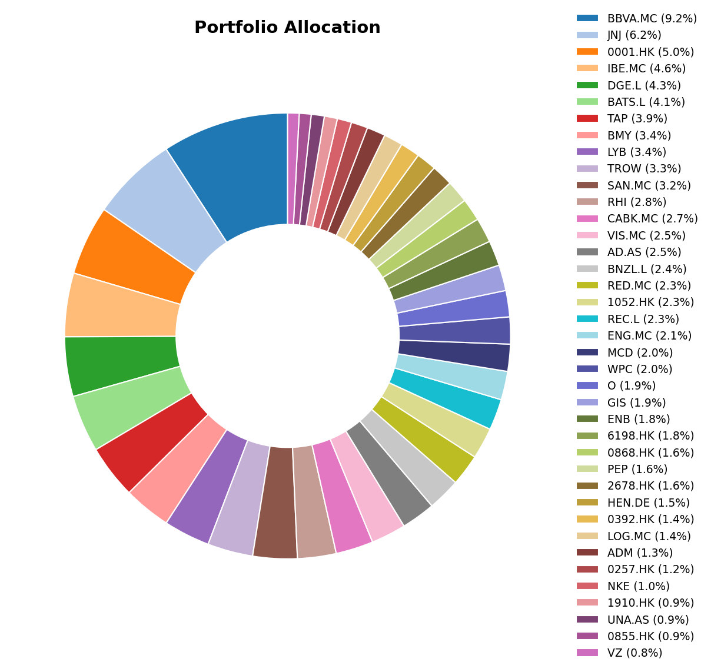
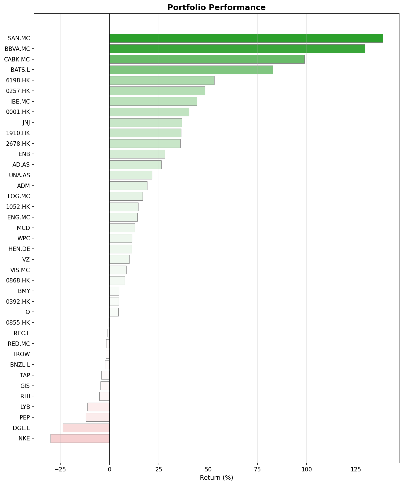
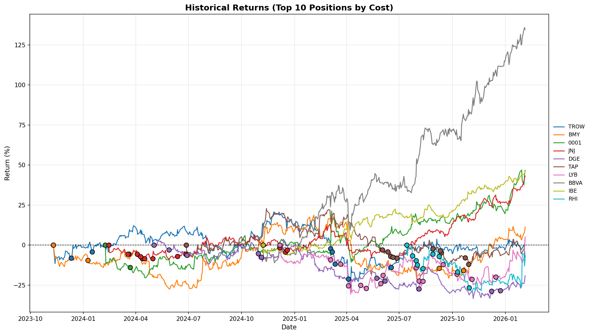

## Major Investing & Economic Events

- **Geopolitical moves**: Venezuela and Iran dominated the news this month (at least my news feed). Difficult to tell what will happen with the oil prices now.
- **European stocks at all-time highs**: It's getting difficult to find investing opportunities in Europe. With so many indices at all-time highs it's easy to fall in value traps so we have to be extra careful.
- **IPO Market Momentum:** Several potential listings of high-profile companies in the horizon (SpaceX, Anthropic, OpenAI...). Exciting months ahead.

## January in Investing History

- **January 1999:** Euro officially introduced.

## Monthly Movers

### Top Performers

**Robert Half (RHI) +26.6%**
Robert Half reported slightly better results than expected. The stock jumped nearly 28% in a single day. Crazy, if you ask me. I'm still positive in the long term so I'll keep waiting for the cycle reversal and happy to receive sweet dividends along the way. Oh, and apparently it's again on the Fortune's 2026 World's Most Admired Companies list for the 29th consecutive year.

**Xinyi Glass (0868.HK) +20.4%**
It seems both Xinyi Glass and Xinyi Solor entered an Electricity Framework Agreement for 2026, but I think this rise is just another signal from the markets recognizing China's recovery.

**CK Hutchison (0001.HK) +17.1%**
An IPO of the health and beauty retailed from CKH seems to have triggered (in my opinion) undeserved optimism in the market. Still, happy to see the price rise.

**Texhong International (2678.HK) +15.5%**
Another cyclical company. I'm simply waiting for the cycle reversal. Oh, and they released a positive profit warning. I hope they will also increase the dividend significantly they generate more than enough cash flow last year.

**Archer Daniels Midland (ADM) +14.0%**
I'm not totally sure I'll keep this one much longer. The dividend is not that large and I'm not sure about the commodity prices. They could very well turn around again. I bought it quite cheap, so I'll probably keep it for a little longer at least.

### Underperformers

**Ahold Delhaize (AD.AS) -5.5%**
Nothing out of the ordinary in this one. A 6% variation is quite standard and I don't think about it twice.

## Portfolio Snapshot

### Allocation

### Performance

### Historical Returns

