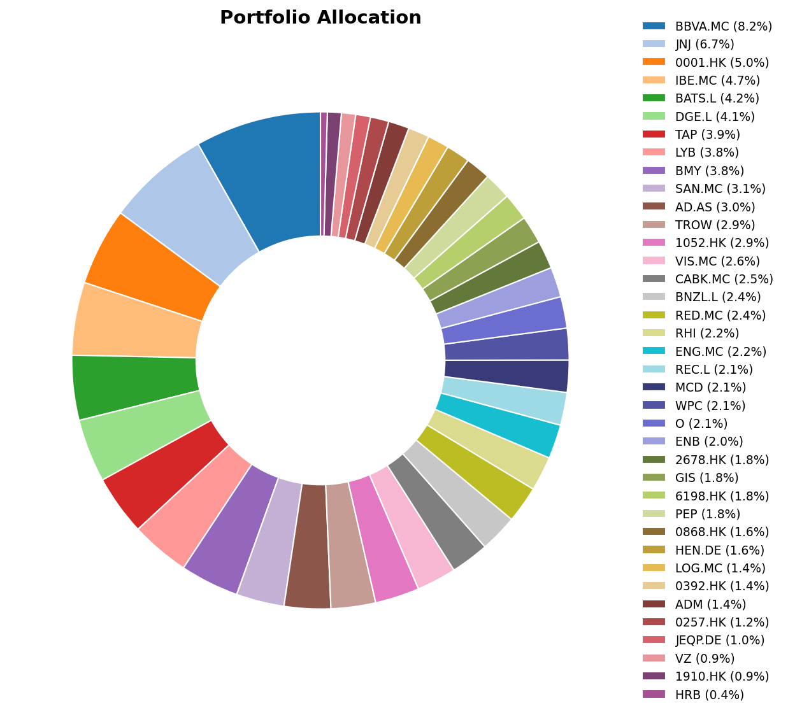
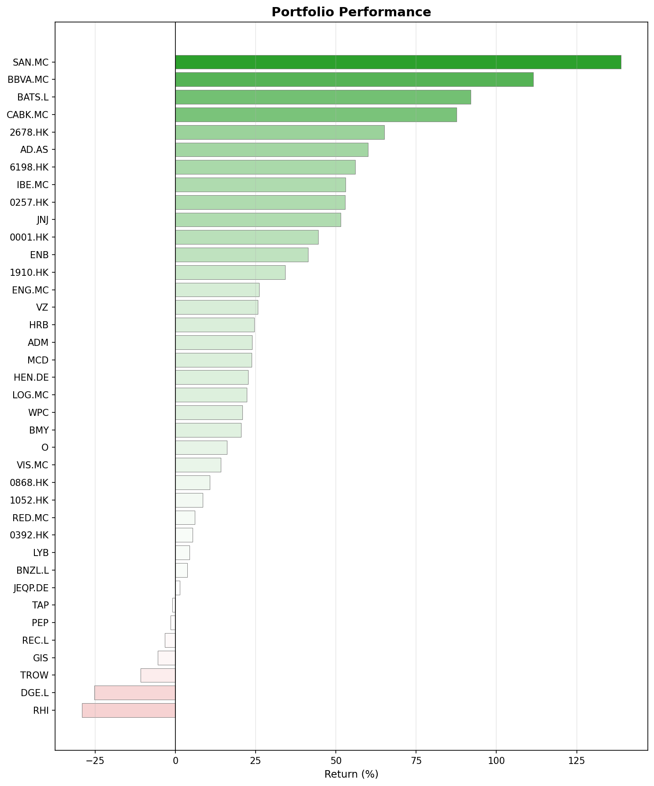
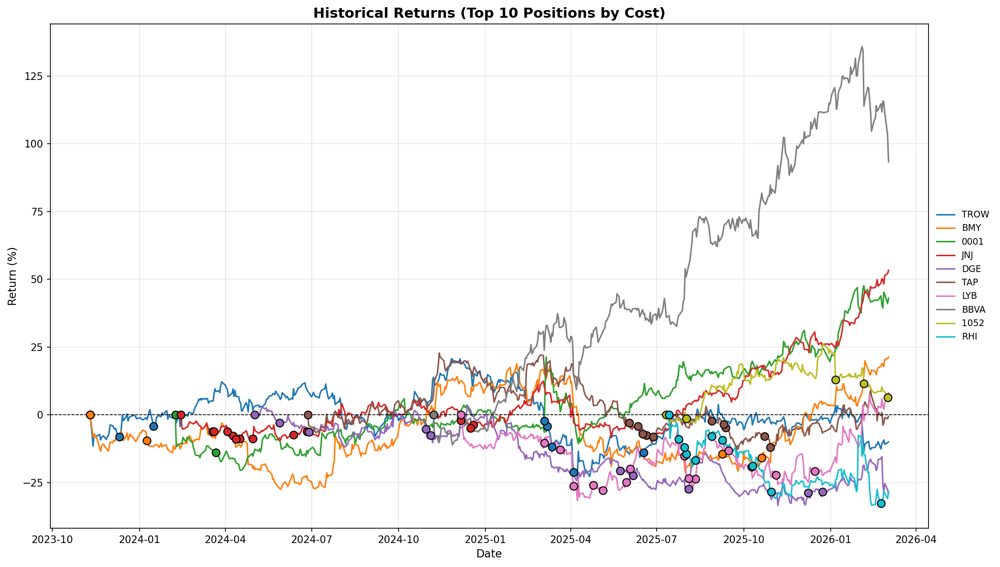

## What happened in February

Mixed results this month. A few climbers and a few stocks when down significantly.

### The Fed stays put, the economy cools

The Federal Reserve held rates steady at its January meeting. The US labor market continued to cool: December's payroll numbers showed one of the slowest years for employment growth in over a decade. The S&P 500 posted back-to-back weekly losses in early February, while the NASDAQ dropped for five consecutive weeks.

### Europe: fiscal stimulus meets geopolitical shock

The ECB held its deposit rate at 2% on February 5. Euro area inflation dipped to 1.7% (not too believable if you ask me).

Then came the shock. Late February saw a sharp escalation in the Middle East. Iranian forces struck critical energy infrastructure, and the blocking of the Strait of Hormuz was announced. A serious hit for worldwide oil and gas flow. The Euro STOXX 50 fell 3.3%, Germany's DAX slid over 3%, and Spain's IBEX 35 and Italy's FTSE MIB both dropped more than 4%. We will see how this evolves.

### China crosses milestones

China's GDP surpassed 140 trillion yuan ($20.4 trillion). The economy expanding is said to be expanding 5% year-on-year in 2025. I hope to see this in the stock market evolution in the coming months.

## A few February anniversaries

- **February 4, 2004 (22 years ago):** Facebook launched from a Harvard dorm room. Love it or hate it, Meta is now one of the most valuable companies on the planet.
- **February 2020 (6 years ago):** COVID hit hard. We all know how it ended.

## Monthly movers

### Top performers

**Ahold Delhaize (AD.AS) +24.9%** was the month's clear winner. Good Q4 earnings seems to have sparked the market's interest. Some analysts raised price targets. As a consumer staples name, maybe it also benefited from a rotation out of growth and into defensive positions.

**Texhong International (2678.HK) +20.7%** likely caught a tailwind from China's economic sentiment. It seems manufacturers with Southeast Asian exposure are seeing improved order books. Could this be finally the inflection point? I hope so, but so I did the last few months too...

**LyondellBasell (LYB) +14.5%** saw a boost from rising energy and commodity prices tied to the Middle East escalation. At the same time, dividends were sliced almost 50%. Overall the market appears to like that managment decision.

### Top losers

**Robert Half (RHI) -26.4%** took the hardest hit. With US job growth at its weakest in years, the outlook for this kind of company is not great. We'll have to keep waiting for the cycle reversal.

**H&R Block (HRB) -20.9%**. This is a new position in my portfolio. It's a boring business and apparently doomed due to the AI. I disagree, but I will not be making it a large position in my portfolio quickly. I'll probably keep buying at the dips until the position reaches max. 2% of my portfolio, probably even less.

**T. Rowe Price (TROW) -11.3%** suffered as an asset manager whose revenue is tied to AUM. Equity markets falling, employment lagging... it's the perfect combination for people to reach out for their savings held in funds. The situation will eventually improve and money will start flowing in again.

**BBVA (BBVA.MC) -9.9%** and **CaixaBank (CABK.MC) -7.8%** were caught in the broader European selloff triggered by the Middle East crisis. BBVA announced a large buyback program. I plan to keep BBVA, but I'll most likely close my position in CaixaBank in the coming weeks/months.

## Portfolio snapshot

### Allocation

### Performance by position

### Historical returns (top 10 positions)

