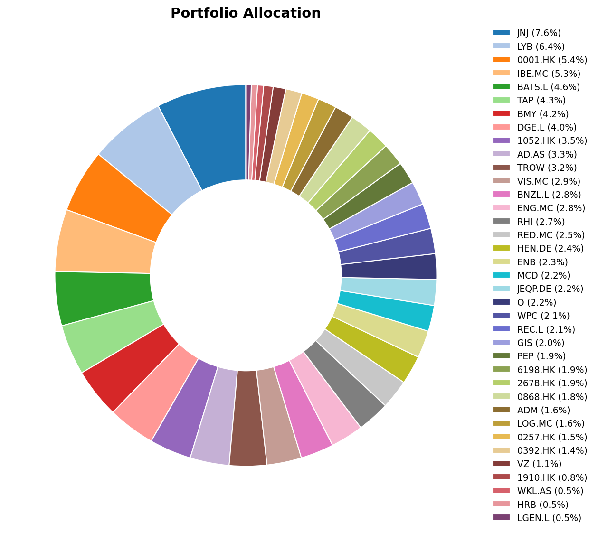
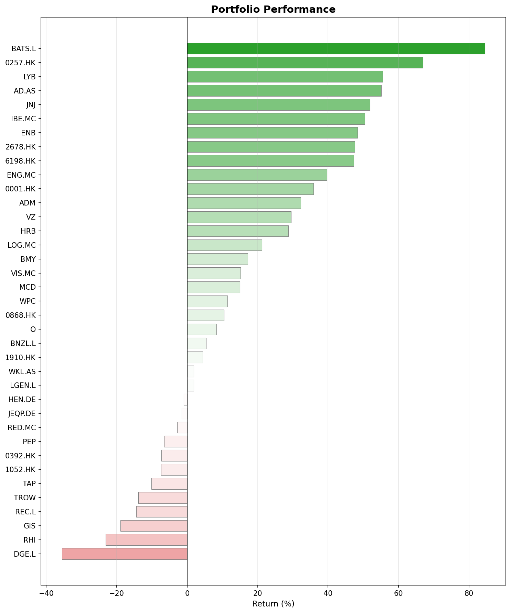
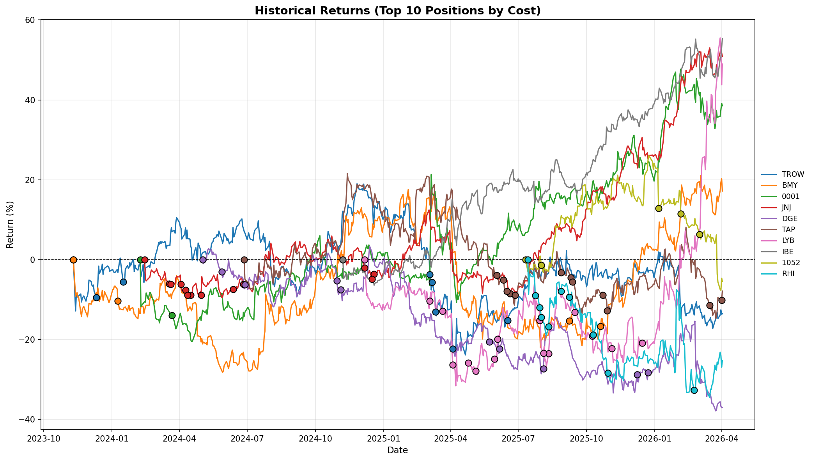

## What happened in March

March 2026 was dominated by one story: the escalating U.S.–Israel conflict with Iran. The Strait of Hormuz was effectively closed, energy infrastructure across the Gulf took damage, and crude climbed above $100 a barrel. Brent surged 63% in a single month, its strongest gain since the 1970s.

Stock markets didn't take it well. The Russell 3000 fell 5%, Germany's DAX and Frace's CAC 40 also went down 8.2% and 7.3% respectively. The Fed held rates steady at 3.5–3.75%, but the tone shifted.

In Europe, the pain came from two directions: the oil shock and the so-called "Second China Shock". The first hit energy-dependent manufacturers hard. The second kept grinding away at competitiveness. Chinese overcapacity is flooding European markets with cheaper goods, squeezing margins in sectors that were already struggling. We will see how EU's response via the "Made in Europe" criteria works.

China had its own problems too. Equity markets fell sharply. The National People's Congress was expected to approve the 15th Five-Year Plan, but a planned U.S.–China summit was postponed after Trump delayed the March 31 Beijing meeting to focus on Iran. That added another layer of geopolitical uncertainty to an already nervous market.

## A month in history

March has a habit of producing turning points. The dot-com bubble peaked on March 10, 2000. The Iraq War began on March 20, 2003, and paradoxically marked the start of a major bull run as the S&P 500 bottomed days later. Bear Stearns collapsed on March 16, 2008, a six-month warning shot before the full financial crisis. The S&P 500 hit its generational low of 666 on March 9, 2009. And the COVID crash bottomed on March 23, 2020, the fastest bear market ever recorded.

## Monthly movers

### Top movers

**LyondellBasell (LYB, +42%)** was the standout winner, and the logic is straightforward. North American petrochemical producers use cheap natural gas liquids as feedstock, not crude oil. When competitors see their costs explode, LYB's stay flat. The company's Gulf Coast facilities sit comfortably outside the Strait of Hormuz disruption zone. Analysts piled in: Citigroup double-upgraded, UBS upgraded, RBC moved to Outperform, KeyBanc upgraded. 

There's a catch, though. LYB cut its dividend by 50% in Q1, from $1.25 to $0.69 per quarter, citing capital preservation for its $1.5 billion "Value Enhancement Program." That stung but it was still a nice 5-6% yield at cost, so I was happy to stay in. Let's see how things go, but I'm already looking at potential sell points.

**Enagás (ENG.MC, +10%)** benefited from the energy crisis. When supply disruptions make gas infrastructure more strategically important, the companies that own the pipes and LNG terminals see their pricing power increase. A solid defensive move in a volatile month.

**Robert Half (RHI, +9%)** and **China Everbright Environment (0257.HK, +8%)** posted more modest gains, likely technical recoveries rather than any major catalyst. Specially RHI, which has been very volatile lately. I do not expect anything else anyways.

### Bottom movers

**Samsonite (1910.HK, −22%)** took the hardest hit. Many difficulties converging: a travel company facing $100 oil, declining TSA checkpoing numbers, cautious airline guidance, thread of 20% tariff incrases... The broader Hong Kong market weakness didn't help.

**General Mills (GIS, −18%)** cut its FY2026 guidance twice in the same quarter. That alone does not look good. Then, analysts slashed price targets and inflationary pressures are compressing margins. The oil spike represents yet another cost headwind not yet baked into results. I will be increasing my position in the consumer defensive sector, although I may look for other alternatives to GIS.

**Henkel (HEN.DE, −17%)** suffered from the European industrial malaise. Its adhesives division has significant exposure to struggling European manufacturing, and higher energy costs on the continent are squeezing margins from both sides. Still, it has a strong financial position and I will be increasing my position at prices under EUR 60.

**Beijing Enterprises Holdings (0392.HK, −15%)** and **Yuexiu Transport Infrastructure (1052.HK, −15%)** fell with the broader Chinese/Hong Kong selloff. Infrastructure and transport names are particularly sensitive to slowing domestic demand, and the delayed U.S.–China summit added uncertainty at the worst possible time. I'm slowly increasing my posiiton in Yuexiu.

## Portfolio snapshot

### Allocation

### Performance

### Historical returns

