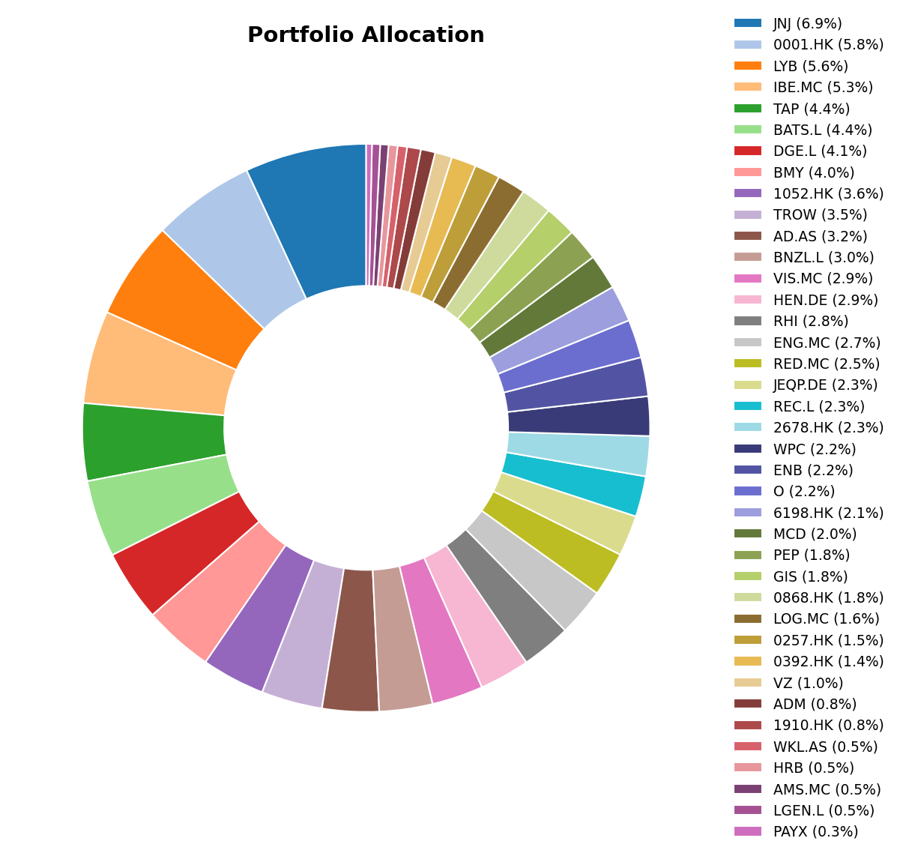
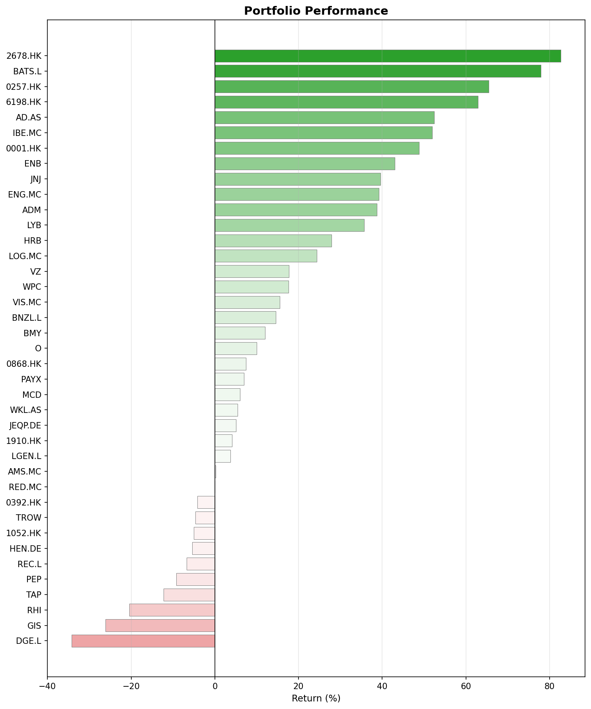
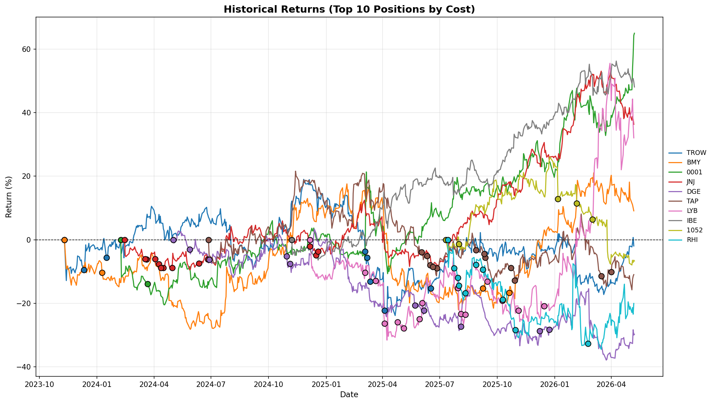

## What happened this month

April's dominant story was the Middle East conflict and its ripple effects through global energy markets. The closing of the Strait of Hormuz and serious damage to critical energy infrastructure sent oil, gas and other derived commodities prices higher. Markets have been very volatile.

In **Europe**, the ECB is now expected to modestly raise policy rates during Q2. In the **US** we saw the rate cut expectations pushed back to 2027. **China** has, of course, also been affected, with a revised growth forecast.

## April in investing history

- This month marks the 51st anniversary of Microsoft's founding by Bill Gates and Paul Allen in Albuquerque, New Mexico, in April 1975.
- It's 40 years since the Chernobyl disaster on April 26, 1986, an event that also affected the markets.

## Monthly movers

### Top performers

**Texhong International (2678.HK) +23.0%** had the strongest month in the portfolio. As a cyclical company manufacturing textiles, it will certainly be affected by the global oil crisis. However, it's difficult to tell if it will be positively or negatively impacted. News of a potential acquisition added fuel to the rally.

**Qingdao Port (6198.HK) +12.8%** likely benefited from the Strait of Hormuz disruption rerouting global shipping patterns and energy flows, increasing trade activity through Chinese ports.

**T. Rowe Price (TROW) +11.8%** beat earnings expectations. The picture wasn't all rosy: AUM declined, as it has been doing for the last few quarters. This may be a signal from the economy. We will see.

**Robert Half (RHI) +10.2%** rebounded from oversold conditions earlier in the year. I don't see any reason yet to justify this rise other than the extreme undervaluation.

### Bottom performers

**Johnson & Johnson (JNJ) -6.9%** had a rough month, but 7% variation is nothing to be worried about, specially regarding a company as stable as JNJ. 

**General Mills (GIS) -5.8%** suffered alongside the broader consumer staples weakness, pressured by rising input costs from higher energy prices and a rotation away from defensives. The whole sector is suffering.

**Bristol-Myers Squibb (BMY) -5.7%** faced similar headwinds to JNJ, with pharma stocks caught between tariff uncertainty and sector rotation.

**McDonald's (MCD) -5.6%** was squeezed from both sides: higher gasoline prices reducing consumer discretionary spending, and rising input costs from the energy shock hitting restaurant margins. Still, very high quality stock. I'm not worried at all and in fact I will increase my position if it keeps going down.

## Portfolio snapshot

### Allocation

### Performance

### Historical returns

