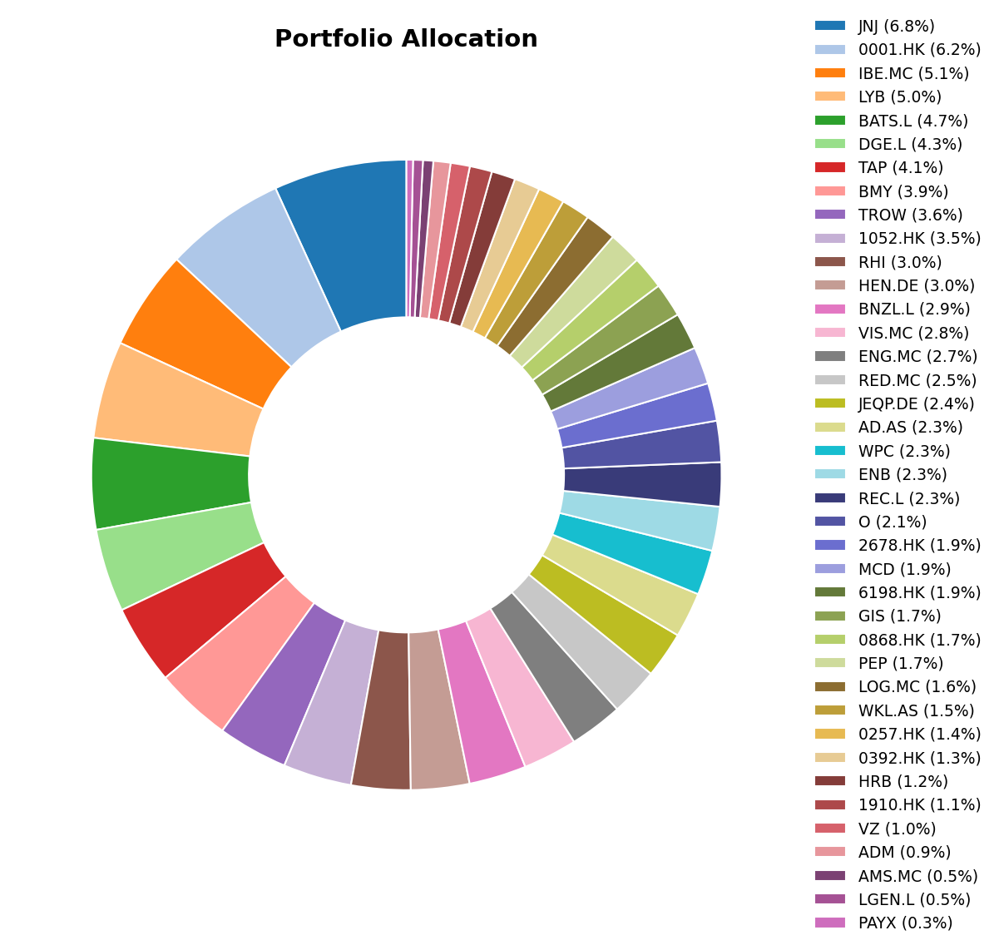
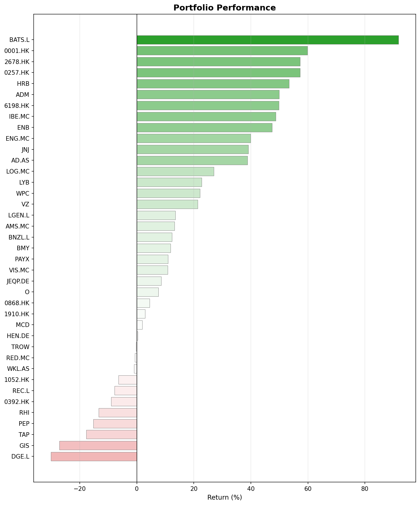
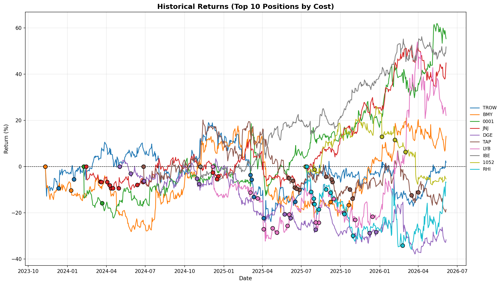

## What happened this month

Very strange month. I would have never thought a tax preparation company would be my portfolio's MVP in May. But here we are, and honestly, it's a good reminder that boring businesses can deliver exciting returns.

The Federal Reserve held rates steady at 3.5%-3.75%, but this was the most divided vote since 1992. Meanwhile, S&P Global slashed its global GDP growth forecast for 2026 from 2.9% to just 2.2%. I am not sure how to take that but there is certainly some concerns within the professional forecasters.

In Europe, the mood is shifting the other direction, but one can never be sure. Rates are expected to rise in June. We will see. Not great for European equities, though some of my UK holdings managed to buck the trend.

Then there's the elephant in the room: the Iran conflict continues to push energy prices higher, which feeds straight into inflation, which keeps central banks nervous, which keeps growth forecasts falling. It's a chain reaction, and it's not going away soon.

## May in investing history

- May 1st marked the 51st anniversary of "May Day" 1975, when the SEC eliminated fixed brokerage commissions. Before that date, every broker charged the same fees. After it, competition drove costs down over decades until we arrived at the zero-commission world we enjoy today.
- May 6th was the 16th anniversary of the 2010 Flash Crash, when the Dow plunged nearly 1,000 points in minutes before bouncing back. It exposed just how fragile algorithmic trading could make the markets. Many of the circuit breakers we have today exist because of that afternoon.

## Monthly Movers

### Top Performers

**H&R Block (HRB) +23%.** The star of the month. Their Q3 FY2026 was a triple beat: earnings, revenue, and guidance all above expectations. The stock surged 26% after the announcement, and shareholder yield is approaching 13%. Tax season is what HRB does, and they nailed it. Sometimes the simplest thesis is the best one.

**Robert Half (RHI) +11%.** After falling 74% from all-time highs, even a modest earnings beat was enough to spark a rally. They reported $0.14 per share against estimates of $0.13. It's a small number, but when a stock is this beaten down, direction matters more than magnitude. The staffing sector might be showing early signs of life but I am not expecting a rally.

**Archer Daniels Midland (ADM) +7%.** ADM hit a new 52-week high after Q1 adjusted EPS of $0.71 beat the $0.66 consensus, and they raised full-year guidance.

### The Losers

**LyondellBasell (LYB) -11%.** This one stings a bit. The chemicals sector is caught between elevated energy costs from the Iran conflict and ongoing corporate restructuring. I expect high volatility in the coming weeks/months.

**PepsiCo (PEP) -8%.** Pepsi cut its annual profit forecast as tariffs push up production costs. Consumer spending on snacks and beverages has been soft, and the stock drifted from ~$158 in April to ~$144 by month end. For a company this large and this stable, an 8% monthly decline is notable. It reflects the poor state of consumer market.

**Molson Coors (TAP) -5%.** Weak Q1 results and a tough consumer environment. The stock is trading near its 52-week low around $39. Very similar to the PepsiCo case.

## Portfolio Snapshot

Here's where things stand at the end of May.

### Allocation

### Performance

### Historical Returns (Top 10 Positions)

Until next month.
