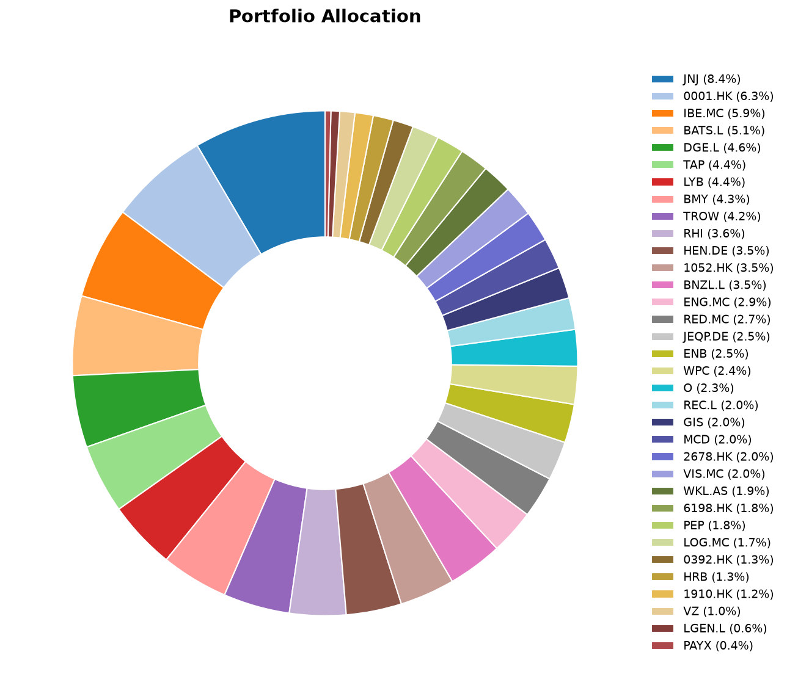
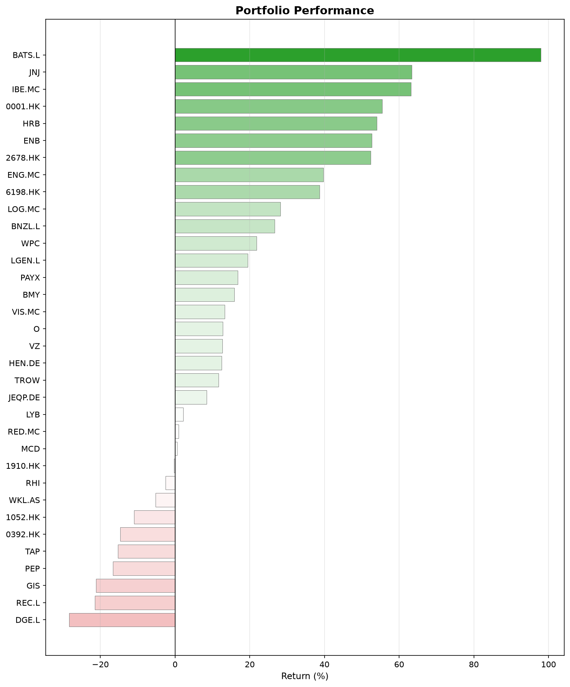
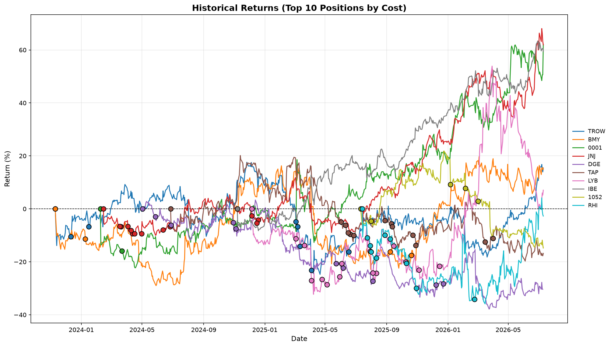

## What happened this month

June 2026 was a busy and complex month for global markets, characterized by a mix of geopolitical shifts, central bank policy divergence, and sectoral volatility.

- **Geopolitics & Oil:** The month began with significant volatility due to disruptions in the Strait of Hormuz. However, mid-month reports of a preliminary U.S.–Iran peace agreement caused a sharp reversal with oil prices dropping rapidly.
- **Monetary Policy Divergence:** Central banks moved in different directions. The U.S. Federal Reserve maintained its current rate stance, while the European Central Bank and the Bank of Japan implemented rate hikes, highlighting the different inflationary pressures facing these regions.
- **China & Trade:** Tensions remained focused on China’s export strength, with ongoing international debates regarding industrial overcapacity and the potential for new trade barriers affecting manufacturing-heavy industries.

## June in investing history

- **June 5, 1933**: The U.S. abandons the domestic gold standard. A congressional resolution invalidated gold clauses in contracts.
- **June 5, 1883**: John Maynard Keynes was born.
- **June 15, 1977**: Apple begins selling the Apple II, one of the first highly successful mass-market personal computers.
- **June 23, 2016**: 10th aniversary of the Brexit vote.

## Monthly Movers

### Top Performers
**Johnson & Johnson (+15.7%).** The main catalyst was a Guggenheim analyst upgrade on June 26, calling JNJ its "Top Pick" in large-cap biopharma with a $270 price target. The analyst cited strong prescription trends for some products, with the company on track for ~$100 billion in annual revenue. JNJ jumped 3.4% that day alone, capping a strong month driven by rotation into defensive healthcare names amid broader market uncertainty.

**Bunzl (+15.1%).** A double catalyst month. First, activist investor Elliott Management disclosed a ~5% stake in mid-June, sending shares up nearly 4% on expectations of strategic pressure. Then on June 23, Bunzl issued a pre-close trading statement upgrading its full-year revenue guidance, driven by a successful turnaround in its North America distribution business. The combination of operational improvement and activist presence created powerful positive momentum.

**Henkel (+13.8%).** No single dramatic June news item here. The rise appears to be a continuation of positive sentiment following strong Q1 results in early May (organic sales growth of 1.7%), combined with a sustained buyback program and a broader European equity rally that favored quality industrials and consumer goods. Henkel's adhesives business, tied to AI and semiconductor supply chains, also attracted thematic investors.

### Bottom Performers
**LyondellBasell (-20.1%).** A triple blow. LYB slashed its quarterly dividend from $1.37 to $0.69 per share. This was compounded by weak pricing and demand across plastics and derivatives, with Q1 sales down 6.3% year-over-year and petrochemical costs rising due to Middle East tensions. Goldman Sachs reiterated a Sell rating during the month, pushing the stock near its 52-week low of $51.11.

**Record Financial Group (-16.7%).** The currency management specialist reported lower annual profits despite a 14% rise in AUM to $114.6 billion. EPS dropped from 5.0p to 3.92p. To make matters worse, the company simultaneously announced board changes and that its finance chief was stepping down, which rarely goes down well with the market. The stock hit a 52-week low of 43.70p shortly after.

**Wolters Kluwer (-11.2%).** No company-specific bad news this month. The likely culprit was the global tech sell-off in late June (SpaceX-led), which hit growth and cloud-software names broadly. The company actually reiterated its guidance and priced a €500 million Eurobond during the month. The decline was purely market-driven.

## Portfolio Snapshot

Here's where things stand at the end of June.

### Allocation

### Performance

### Historical Returns (Top 10 Positions)

Until next month.
